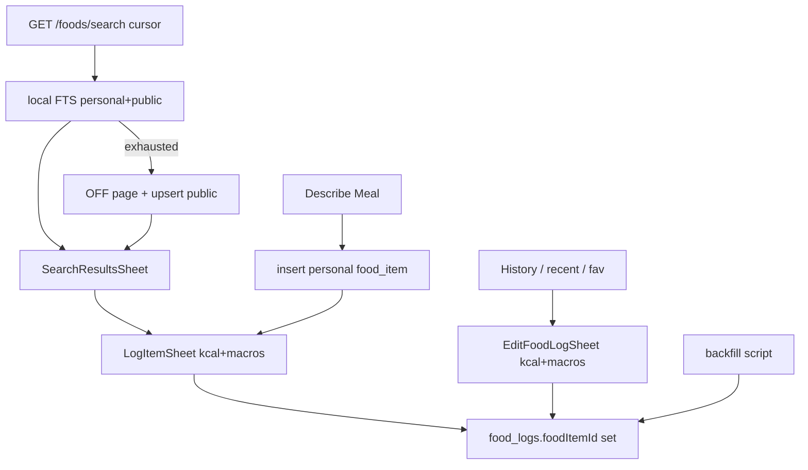

# Catalog-first search, foodItemId everywhere, and sheet macros

## Status

**Implemented** on `staging` (backend phases 1–5; mobile phases 6–8; admin contracts bumped to `0.16.0`).

| Phase | Repo | Outcome |
|-------|------|---------|
| 1 — Shared OFF upsert | `thrivo-backend` | `upsertOffProduct` shared by barcode lookup |
| 2 — Paginated catalog-first search + contracts `0.16.0` | `thrivo-backend` | Cursor local→external; page size 10; `FoodItem[]` |
| 2b — Publish gate | npm | `@beorchid-llc/thrivo-contracts@0.16.0` published; consumers bumped |
| 3 — Describe → personal item | `thrivo-backend` | Estimate log creates personal catalog row + `foodItemId` |
| 4 — externalFood bridge | `thrivo-backend` | Upsert-then-log so every food log gets a catalog id |
| 5 — Backfill null FKs | `thrivo-backend` | `scripts/backfill-food-log-item-ids.ts` (+ tsup / npm deploy scripts) |
| 6 — SearchResultsSheet | `thrivo-mobile` | Infinite search sheet; contracts `^0.16.0` |
| 7 — Macros in add/edit sheets | `thrivo-mobile` | kcal free; P/C/F + `PremiumGate` |
| 8 — Logging / favourites polish | `thrivo-mobile` | Always `foodItemId`; hearts on rows; favorites-only de-dupe |

**Ops still required (not code):** run the Phase 5 backfill on staging/production (dry-run → `--apply`) via Coolify per `INFRA_SETUP_GUIDE.md` §15.

---

## Goal

Every **food** log (search, barcode, personal, describe/estimate) resolves to a `food_items` row with a real `foodItemId`. Search is personal + public in our DB first, paginated 10/page in a bottom sheet, Open Food Facts only after local exhaustion. Old null-id logs are repaired by backfill. Add/edit food bottom sheets show **kcal + macros**, with **PremiumGate** for free users.

Favourites stay scoped by **`foodItemId`** (catalog row), not log id — universal `foodItemId` unlocks hearts on all food surfaces.

---

## Will every food log have a `foodItemId`?

**Going forward — yes, for all food diary paths:**

| Path | Behaviour |
|------|-----------|
| Barcode lookup → log | Catalog id via shared OFF upsert |
| Search → log | Always `FoodItem.id` |
| Personal / custom food → log | Already has id |
| Describe Meal / estimate → log | Creates **personal** `food_item`, then logs with that id |
| Favorites / recent re-log | Uses existing catalog id |

**Not food logs:** water entries — no `foodItemId` by design.

**Legacy rows:** `food_logs` with `food_item_id IS NULL` → Phase 5 backfill.

---

## Key decisions

### Personal vs public

Reuse existing columns — no new `scope` DB column.

| Scope | Meaning |
|-------|---------|
| personal | `tier = personal`, `owner_user_id = user` (includes describe/estimate items) |
| public | `tier = authoritative` (OFF cache); community later |

Search visibility = personal-owned ∪ public authoritative.

### Local then external pagination

Two-phase cursor, page size **10**, never call OFF until local is exhausted:

- `local:<offset>` → Postgres FTS
- Exhausted → `external:<page>` → OFF page N → upsert public rows → `FoodItem[]`
- No mixing local + OFF in one page
- Client: `useInfiniteQuery`; auto-fetch once if first local page is empty but `nextCursor` is external

### Describe Meal → personal item

On confirm/log: insert personal `food_item` + nutrients → create log with that id → searchable next time with **Estimated** badge.

### Backfill (`food_item_id IS NULL`)

Script: `thrivo-backend/scripts/backfill-food-log-item-ids.ts`

- Dry-run by default; `--apply` to write
- Keyset on `food_logs.id`; checkpoints in `os.tmpdir()`; separate dry-run vs apply files
- **Never rewrite** kcal/macro snapshot columns — only set `food_item_id`
- Resolution: barcode → personal name match → create personal from snapshot

Coolify:

```bash
node dist/backfill-food-log-item-ids.js
node dist/backfill-food-log-item-ids.js --apply
```

### Macros in add/edit bottom sheets

Surfaces: `LogItemSheet`, `EditFoodLogSheet`

- Always show **kcal** (free)
- **Protein / Carbs / Fat** via shared `MacroCards`, scaled with quantity × serving
- Free users: wrap macros in `PremiumGate` + `useEntitlement().isPremium`
- Search result rows stay kcal (+ Estimated); full macros live in the sheet after tap

---

## Target flows



---

## Mobile touchpoints

| Area | Location |
|------|----------|
| Infinite search hook | `src/features/food-logging/hooks/useFoodLogging.ts` → `useFoodSearch` |
| Search API | `src/features/food-logging/api/food-logging.api.ts` → `searchFoods(q, { limit, cursor })` |
| Results sheet | `src/features/food-logging/components/SearchResultsSheet.tsx` |
| Result row + heart | `src/features/food-logging/components/FoodResultRow.tsx` |
| Add sheet | `src/features/food-logging/components/LogItemSheet.tsx` |
| Edit sheet | `src/features/food-logging/components/EditFoodLogSheet.tsx` |
| Macro strip | `src/features/food-logging/components/MacroCards.tsx` |
| Contracts | `@beorchid-llc/thrivo-contracts` `^0.16.0` |

---

## Explicitly out of scope

- Water as food items / water favourites  
- New DB `scope` column  
- Bulk USDA seed / community ranking  
- Rewriting historical kcal/macro snapshot values during backfill  
- Auto-favourite on every log  

---

## Risks (accepted mitigations)

| Risk | Mitigation |
|------|------------|
| Backfill creates near-duplicate personal items | Prefer barcode; name-match within user before create; report counters |
| Snapshot ÷ servings for new personal nutrients | Prefer barcode/OFF when barcode present |
| Free users still see blurred macro numbers | Same as dashboard `PremiumGate` |
| Macro scale drift vs server | Same serving-choice helpers as log payload |

---

## Direct answers

1. **All new food logs get `foodItemId`?** Yes (Phases 1–4 + mobile). Water is not a food log.  
2. **Old logs?** Phase 5 backfill links or creates personal items and sets the FK.  
3. **Macros in sheets?** Phase 7 — kcal free; macros premium-gated via `PremiumGate` + entitlement.
